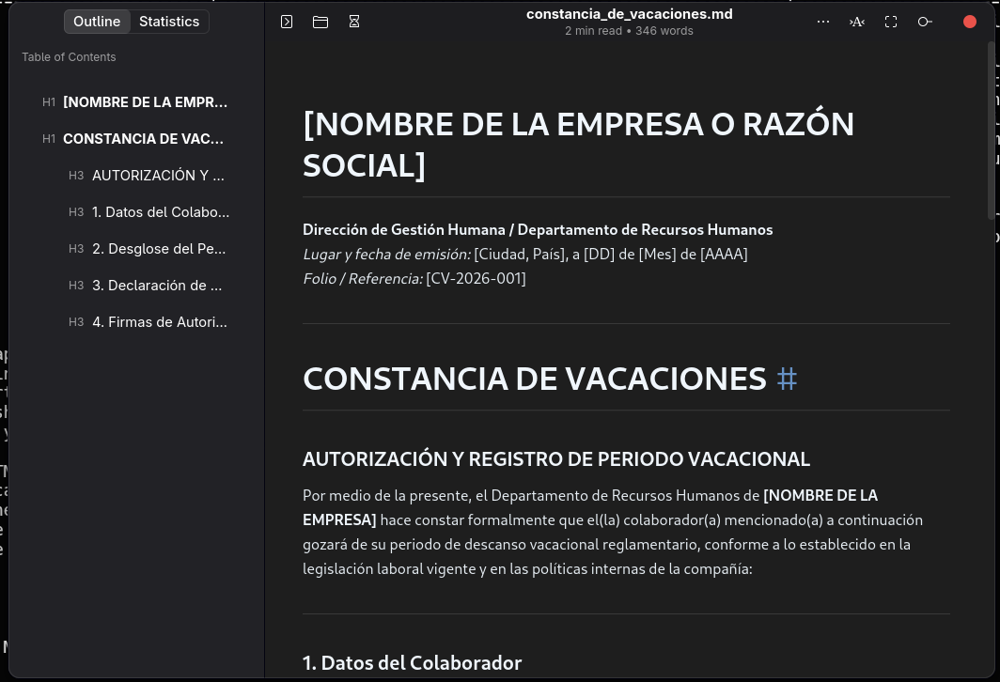
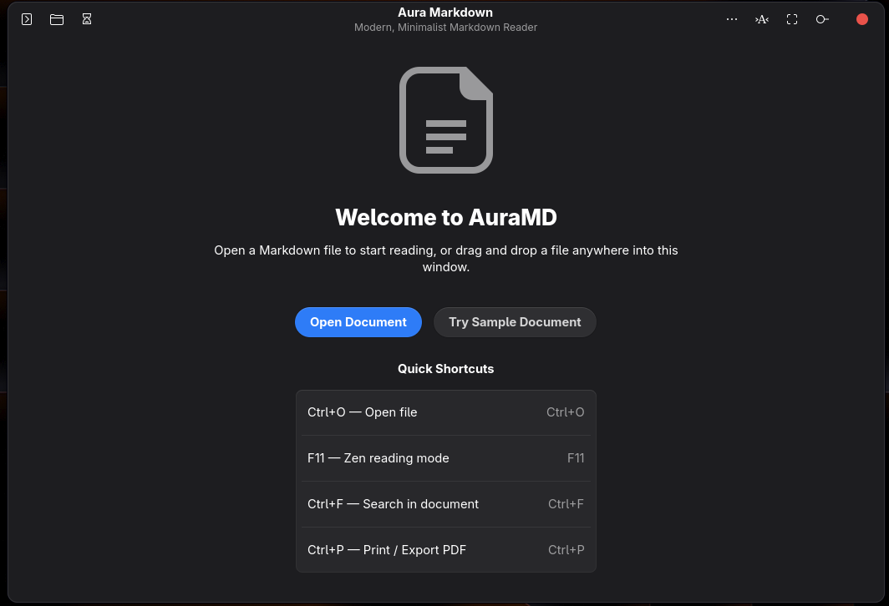
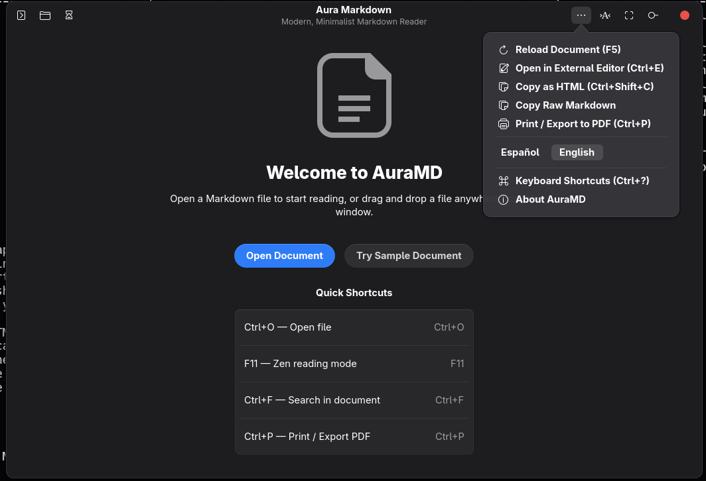

# AuraMD 🚀

A simple, modern, and clean Markdown reader for Linux.

AuraMD helps you read Markdown files (`.md`) easily. It is fast, looks great on your desktop, and has no distractions.

---

## 📸 Screenshots

### Document View with Outline (Table of Contents)
Navigate sections easily and see reading stats on the left sidebar:


### Clean Welcome Screen
Open your documents or try the sample file with one click:


### Main Menu & Quick Actions
Switch between English and Spanish, export to PDF, or copy HTML:


---

## ✨ Features

- **Clean and Modern Design**: Made for modern Linux desktops (GNOME / Libadwaita). It has smooth rounded corners and clean colors.
- **Two Languages (English & Spanish)**: You can change the language with one click from the menu.
- **Zen Mode (`F11`)**: Full-screen reading mode. It hides all buttons and menus so you can focus on your text.
- **Table of Contents (Outline)**: Shows all headings in your document. You can click any heading to jump to that part.
- **Document Statistics**: Shows reading time, word count, character count, and total lines.
- **Live Auto-Reload**: When you edit your file in another app (like VS Code or Vim), AuraMD updates the page automatically. It keeps your scroll position!
- **Search in Document (`Ctrl + F`)**: Fast search with match counts and next/previous buttons.
- **Light and Dark Themes**: Matches your system theme, or you can pick Light or Dark mode.
- **Typography Controls**: Choose between Sans, Serif, or Monospace fonts. Change the text size and the reading width.
- **Works 100% Offline**:
  - Code blocks with syntax highlighting and a "Copy" button.
  - Math formulas with LaTeX ($E = mc^2$).
  - Diagrams with Mermaid.
  - Tables and interactive task lists (`- [x]`).
- **Drag and Drop**: Drop any `.md` file into the window to open it immediately.
- **Print or Export to PDF (`Ctrl + P`)**: Print your notes or save them as PDF files.

---

## 🚀 How to Use

### Run from the Terminal

Open the app:
```bash
auramd
```

Open a specific file:
```bash
auramd my_notes.md
```

Try the sample file:
```bash
auramd /home/arbey/development/auramd/demo_en.md
```

### Run from the Application Menu
You can find **Aura Markdown** in your desktop application menu. You can also right-click any `.md` file and choose "Open With Aura Markdown".

---

## ⌨️ Keyboard Shortcuts

| Shortcut | Action | What it does |
| :--- | :--- | :--- |
| `Ctrl + O` | Open File | Choose a Markdown file from your computer |
| `F11` | Zen Mode | Turn on full-screen reading without distractions |
| `Esc` | Exit Zen Mode | Go back to normal window |
| `F9` | Sidebar | Show or hide the Outline and Statistics |
| `Ctrl + F` | Search | Find words inside the document |
| `Ctrl + P` | Print / PDF | Print or save the file as a PDF |
| `Ctrl + R` / `F5` | Reload | Reload the file from the disk |
| `Ctrl + E` | External Editor | Open the file in your favorite text editor |
| `Ctrl + +` | Zoom In | Make text bigger |
| `Ctrl + -` | Zoom Out | Make text smaller |
| `Ctrl + 0` | Reset Zoom | Set text back to normal size |
| `Ctrl + Q` | Quit | Close the application |

---

## 📁 Files in This Project

```text
auramd/
├── assets/
│   └── screenshots/        # Project screenshots
├── auramd/
│   ├── app.py              # Main application logic
│   ├── window.py           # The window, sidebar, and controls
│   ├── markdown_engine.py  # Converts Markdown into HTML
│   ├── i18n.py             # English and Spanish translations
│   ├── config.py           # Saves your settings
│   └── assets/
│       ├── template.html   # The HTML/CSS design template
│       ├── icons/          # Application logo (SVG)
│       └── vendor/         # Offline scripts (Marked, KaTeX, Mermaid)
├── demo_en.md              # Sample document in English
├── demo_es.md              # Sample document in Spanish
├── io.github.auramd.AuraMD.desktop  # Desktop launcher file
└── README.md
```

---

## 📜 License

This project is open-source under the MIT License. Free to use and modify!
# AuraMD
