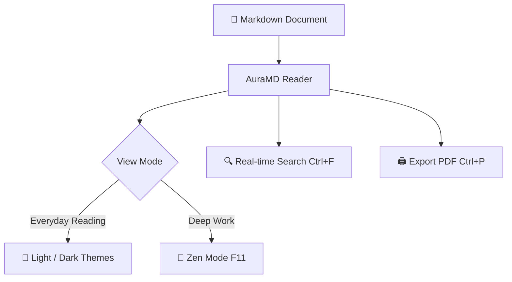

# Welcome to AuraMD 🚀

**AuraMD** is a **modern**, **minimalist**, and **fluid** Markdown reader designed exclusively for Linux, strictly following the GNOME Human Interface Guidelines (HIG) and Libadwaita.

> [!TIP]
> You can open any `.md` file by running `auramd my_file.md` in your terminal, pressing `Ctrl + O`, or simply dragging and dropping a file into this window.

---

## 📑 Table of Contents & Features

- [Distraction-free Zen Mode](#distraction-free-zen-mode)
- [Rich Alerts and Callouts](#rich-alerts-and-callouts)
- [Syntax Highlighting & Code Blocks](#syntax-highlighting--code-blocks)
- [Mathematical Formulas with KaTeX](#mathematical-formulas-with-katex)
- [Interactive Diagrams with Mermaid](#interactive-diagrams-with-mermaid)
- [Interactive Task Lists](#interactive-task-lists)
- [Keyboard Shortcuts Table](#keyboard-shortcuts-table)

---

## 🧘 Distraction-free Zen Mode

Need full focus without bars or buttons?
Press <kbd>F11</kbd> or click the fullscreen icon in the top header bar to toggle **Zen Mode**.

> [!NOTE]
> At any time, you can press <kbd>Esc</kbd> or <kbd>F11</kbd> to exit Zen Mode and return to the standard layout.

---

## 💡 Rich Alerts and Callouts

AuraMD natively renders GitHub Flavored Markdown alert blocks:

> [!NOTE]
> Useful information that users should know, even when skimming.

> [!TIP]
> Helpful advice for doing things better or more easily.

> [!IMPORTANT]
> Key information users need to know to achieve their goal.

> [!WARNING]
> Urgent info that needs immediate user attention to avoid problems.

> [!CAUTION]
> Advises about risks or negative outcomes of certain actions.

---

## 💻 Syntax Highlighting & Code Blocks

Each code snippet includes per-language syntax highlighting and a 1-click **Copy** button with instant feedback:

### Python 3:
```python
def quicksort(arr: list[int]) -> list[int]:
    """Sorts an array using the divide-and-conquer quicksort algorithm."""
    if len(arr) <= 1:
        return arr
    pivot = arr[len(arr) // 2]
    left = [x for x in arr if x < pivot]
    middle = [x for x in arr if x == pivot]
    right = [x for x in arr if x > pivot]
    return quicksort(left) + middle + quicksort(right)

print(quicksort([3, 6, 8, 10, 1, 2, 1]))
```

### Rust:
```rust
fn main() {
    println!("Hello from AuraMD on Linux!");
}
```

---

## 📐 Mathematical Formulas with KaTeX

Ultra-fast rendering of LaTeX equations both inline and in display blocks:

The mass-energy equivalence equation: $E = mc^2$.

The Gaussian integral:

$$\int_{-\infty}^{\infty} e^{-x^2} dx = \sqrt{\pi}$$

And the famous Euler's identity:

$$e^{i\pi} + 1 = 0$$

---

## 📊 Interactive Diagrams with Mermaid

Render flowcharts, sequence diagrams, and architecture graphs right inside the document:



---

## ✅ Interactive Task Lists

- [x] Modern minimalist UI built with Libadwaita & GTK4
- [x] Full bilingual support for English and Spanish with runtime switching
- [x] Auto-generated outline & reading statistics in collapsible sidebar
- [x] Disk watcher with auto-reload on file edits
- [x] Native print and PDF export with `Ctrl + P`
- [ ] Read all your favorite docs and notes

---

## ⌨️ Keyboard Shortcuts Table

| Shortcut | Action | Description |
| :--- | :--- | :--- |
| `Ctrl + O` | Open File | Open native file chooser dialog |
| `F11` | Zen Mode | Toggle distraction-free full reading canvas |
| `F9` | Sidebar | Show / hide outline and document stats |
| `Ctrl + F` | Search | Find text in document with match counter |
| `Ctrl + P` | Print / PDF | Print or export document directly to PDF |
| `Ctrl + R` / `F5` | Reload | Reload document from disk |
| `Ctrl + E` | External Editor | Open file in your preferred editor |
| `Ctrl + +` / `Ctrl + -` | Zoom | Adjust zoom level dynamically |

---

Enjoy reading Markdown with speed, elegance, and zero distractions!
