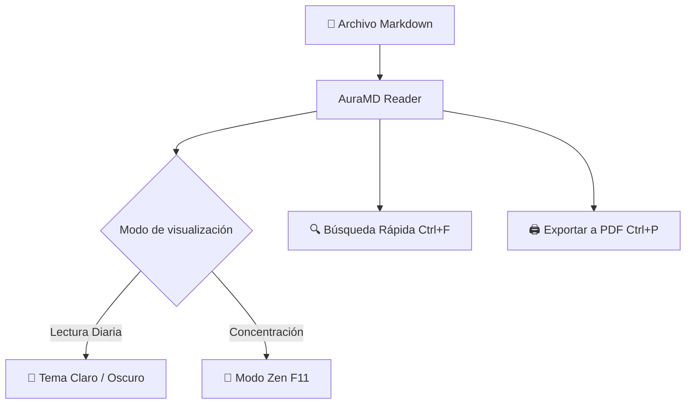

# Bienvenido a AuraMD 🚀

**AuraMD** es un lector de Markdown **moderno**, **minimalista** y **fluido** diseñado exclusivamente para Linux, siguiendo las directrices de interfaz humana (HIG) de GNOME y Libadwaita.

> [!TIP]
> Puedes abrir cualquier archivo `.md` ejecutando `auramd mi_archivo.md` en tu terminal, usando `Ctrl + O`, o simplemente arrastrando el archivo dentro de esta ventana.

---

## 📑 Tabla de Contenidos y Características

- [Modo Zen sin distracciones](#modo-zen-sin-distracciones)
- [Alertas y notas enriquecidas](#alertas-y-notas-enriquecidas)
- [Resaltado de sintaxis y código](#resaltado-de-sintaxis-y-código)
- [Fórmulas matemáticas con KaTeX](#fórmulas-matemáticas-con-katex)
- [Diagramas interactivos con Mermaid](#diagramas-interactivos-con-mermaid)
- [Listas de tareas interactivas](#listas-de-tareas-interactivas)
- [Tablas de datos elegantes](#tablas-de-datos-elegantes)

---

## 🧘 Modo Zen sin distracciones

¿Deseas una lectura inmersiva sin barras ni botones?
Presiona <kbd>F11</kbd> o haz clic en el icono de pantalla completa en la barra superior para activar el **Modo Zen**.

> [!NOTE]
> En cualquier momento puedes presionar <kbd>Esc</kbd> o <kbd>F11</kbd> para salir del Modo Zen y volver a la vista estándar.

---

## 💡 Alertas y notas enriquecidas

AuraMD soporta de manera nativa los bloques de llamada de GitHub Flavored Markdown:

> [!NOTE]
> Esta es una nota informativa sobre una característica o contexto útil.

> [!TIP]
> Usa `Ctrl + F` para buscar en tiempo real dentro del documento abierto con contador de coincidencias.

> [!IMPORTANT]
> AuraMD vigila en tiempo real las modificaciones en disco. Si editas este archivo en tu editor favorito, se recargará automáticamente preservando tu posición de lectura.

> [!WARNING]
> Ten cuidado al modificar archivos protegidos por el sistema.

> [!CAUTION]
> Acción destructiva o que requiere confirmación cuidadosa.

---

## 💻 Resaltado de sintaxis y código

Cada bloque de código incluye resaltado de sintaxis por lenguaje y un botón minimalista para **copiar al portapapeles** con confirmación visual:

### Python 3:
```python
def fibonacci(n: int) -> list[int]:
    """Genera la secuencia de Fibonacci hasta n elementos."""
    if n <= 0:
        return []
    seq = [0, 1]
    while len(seq) < n:
        seq.append(seq[-1] + seq[-2])
    return seq[:n]

# Ejemplo de uso
print(fibonacci(10))
```

### Rust:
```rust
fn main() {
    let message = "Hola desde AuraMD en Linux";
    println!("{message}");
}
```

### Bash:
```bash
# Abrir un documento directamente desde la terminal
auramd ~/Documentos/notas.md
```

---

## 📐 Fórmulas matemáticas con KaTeX

Renderizado ultra-rápido de ecuaciones matemáticas LaTeX tanto en línea como en bloque:

La famosa ecuación de equivalencia masa-energía es $E = mc^2$.

También la integral gaussiana:

$$\int_{-\infty}^{\infty} e^{-x^2} dx = \sqrt{\pi}$$

Y la serie de Taylor para la función exponencial:

$$e^x = \sum_{n=0}^{\infty} \frac{x^n}{n!} = 1 + x + \frac{x^2}{2!} + \frac{x^3}{3!} + \cdots$$

---

## 📊 Diagramas interactivos con Mermaid

Visualiza diagramas de flujo, arquitecturas y gráficos directamente en el lector:



---

## ✅ Listas de tareas interactivas

- [x] Lector moderno y minimalista con Libadwaita
- [x] Soporte nativo para Español e Inglés con cambio dinámico
- [x] Índice dinámico y estadísticas del documento en la barra lateral
- [x] Recarga automática al detectar cambios en disco
- [x] Exportación a PDF e impresión con `Ctrl + P`
- [ ] Explorar todas tus notas y artículos favoritos

---

## 📊 Tablas de datos elegantes

| Atajo de teclado | Acción | Descripción |
| :--- | :--- | :--- |
| `Ctrl + O` | Abrir archivo | Abre el selector de archivos nativo |
| `F11` | Modo Zen | Alterna la lectura sin distracciones |
| `F9` | Barra lateral | Muestra u oculta el índice y las estadísticas |
| `Ctrl + F` | Búsqueda | Busca cualquier texto dentro del documento |
| `Ctrl + P` | Imprimir / PDF | Imprime o exporta directamente a PDF |
| `Ctrl + R` / `F5` | Recargar | Fuerza la recarga del archivo desde el disco |
| `Ctrl + E` | Editor externo | Abre el archivo en tu editor de código preferido |
| `Ctrl + +` / `Ctrl + -` | Zoom | Ajusta el nivel de zoom en tiempo real |

---

¡Disfruta de una experiencia de lectura de Markdown rápida, hermosa y sin distracciones!
